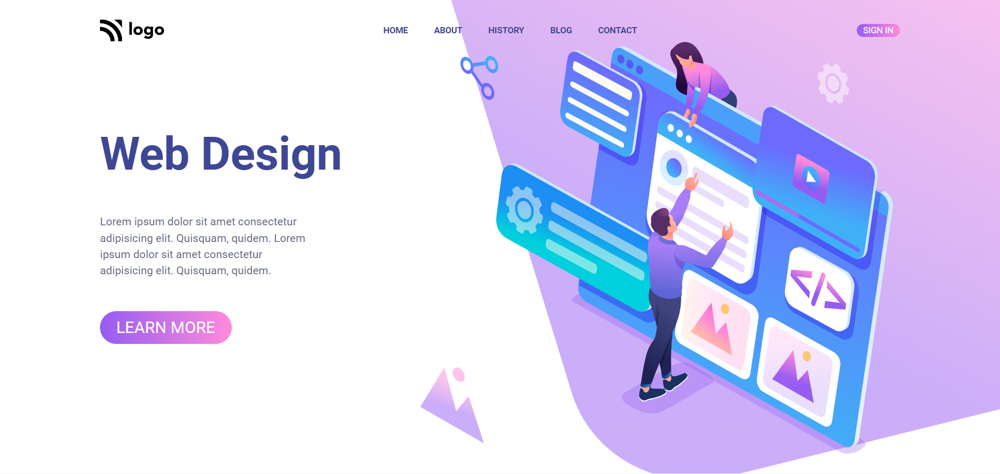

# Assignment 1

## Project 8 [Live Link](https://web-design-og.netlify.app)

-   Skills Gained in this project
    -   Learned about linear-gradient property for styling elements.
    -   Learned about how to use the CSS varibles. 

---

## Time taken to finish this project

-   Approximately 5-6 hour taken to complete this one.

#### Screenshot

